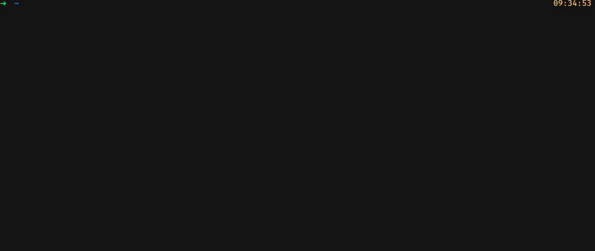
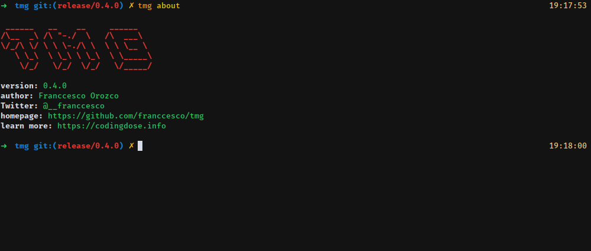

# Tmg

A CLI built in Ruby to track your gems stats on RubyGems.org. This is mostly a personal project to keep track of my gems and also to checkout the latest version information of another gem. I grew tired of going to the rubygems.org website or the github repo of a project to check what's the latest version of a gem to add it to my project.


## Installation

Install it yourself as:

    $ gem install tmg

## Usage


### Login to RubyGems.org
First you have to login to the RubyGems.org repository with:

    $ tmg login

Input your username and password and you should good to go.

### Commands
```sh
$ tmg help
Commands:
  tmg about            # Displays version number and information.
  tmg help [COMMAND]   # Describe available commands or one specific command
  tmg info [GEM]       # Shows information about a specific gem.
  tmg list             # Show a list of your published gems.
  tmg login            # Request access to RubyGems.org
  tmg user [USERNAME]  # Shows gems owned by another username
  tmg version [gems]   # Displays latest version of gems.
```

## Development
If you're interested and want to invest your time in this project you can fork the repository and submit changes to the **develop** branch!

## Contributing

Bug reports and pull requests are welcome on GitHub at https://github.com/franccesco/tmg. This project is intended to be a safe, welcoming space for collaboration, and contributors are expected to adhere to the [Contributor Covenant](http://contributor-covenant.org) code of conduct.

## License

The gem is available as open source under the terms of the [MIT License](https://opensource.org/licenses/MIT).

## Code of Conduct

Everyone interacting in the Tmg project’s codebases, issue trackers, chat rooms and mailing lists is expected to follow the [code of conduct](https://github.com/[USERNAME]/tmg/blob/master/CODE_OF_CONDUCT.md).


